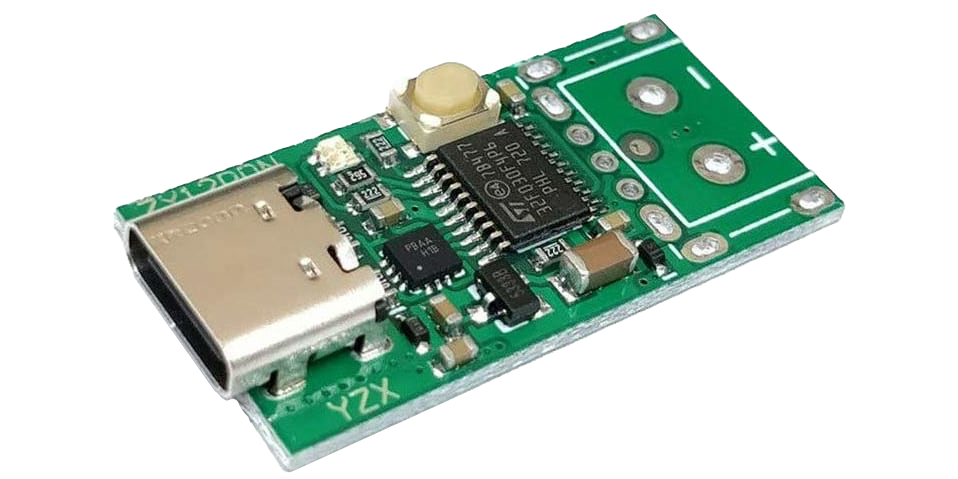
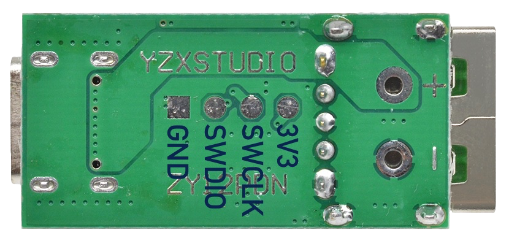

# Open-Source Firmware for ZY12PDN USB-PD

Open-source firmware for USB Power Delivery trigger board based on an FUSB302B power delivery controller and a STM32F030F4 MCU.

## Building and Uploading

The firmware is built using Visual Studio Code and the PlatformIO extension.

To upload it, a SWD capable debug probe like ST-Link, J-Link or Black Magic Probe is connected to the four SWD pads on the back side of the board.

See [Build and upload](https://github.com/manuelbl/zy12pdn-oss/wiki/Build-and-upload) in the wiki for detailed instructions.

## Usage Instructions

The user interface – if it can be called so – is similar to the original ZY12PDN. The board can work in one of three modes:

- **Interactive mode**: By pressing the button, the board switches between available voltages.
- **Fixed voltage mode**: The board provides a configured voltage. If the configured voltage is not available, the board will output 5V.
- **Configuration mode**: By pressing the button, either the interactive mode or one of the fixed voltage modes is selected.

The LED color indicates either the active voltage (interactive and fixed voltage mode) or the desired voltage (configuration mode).

| Color  | Interactive | Fixed Voltage | Configuration |
| :----- | :-- | :-- | :-- |
| Red    | 5V  | Configured voltage is not available † | Configure interactive mode. |
| Yellow | 9V  | 9V  | Configure fixed voltage mode with 9V. |
| Green  | 12V | 12V | Configure fixed voltage mode with 12V. |
| Cyan   | 15V | 15V | Configure fixed voltage mode with 15V. |
| Blue   | 20V | 20V | Configure fixed voltage mode with 20V. |
| Purple | –   | -   | Configure fixed voltage mode with highest available voltage. |

*† The LED will also blink in red if the board has been configured for the highest available voltage and the highest available voltage is neither 9V, 12V, 15V nor 20V.*

### Configuring the Board

The configuration mode is entered by plugging in the board while pressing the button. The LED will initially flash quickly in cyan until the button is released. Then it continues to flash to indicate the configuration mode.

The mode can be selected by pressing the button until the desired voltage or mode (see table above) has been selected. To save the configuration, the button must be pressed for a longer period until the LED goes off. While in configuration mode, the output voltage remains at 5V.

*Note: Even if a fixed voltage above 5V has been selected and the selected voltage can be provided by the power supply, the supply will initially proivde 5V until the target voltage has been successfully negotiated. 5V is also provided at the output of the ZY12PDN board as it is passed through directly. There is no switch (or MOSFET) in between.*

## Documentation

Additional documentation can be found in the [Wiki](https://github.com/manuelbl/zy12pdn-oss/wiki/Hardware-versions):

- [Hardware analysis](https://github.com/manuelbl/zy12pdn-oss/wiki/Hardware-analysis)

- [Hardware versions](https://github.com/manuelbl/zy12pdn-oss/wiki/Hardware-versions)

- [USB PD introduction](https://github.com/manuelbl/zy12pdn-oss/wiki/USB-PD-introduction)

- [Software implementation notes](https://github.com/manuelbl/zy12pdn-oss/wiki/Implementation-notes)

- [Build and Uplaod](https://github.com/manuelbl/zy12pdn-oss/wiki/Build-and-upload)

- [Debugging hints](https://github.com/manuelbl/zy12pdn-oss/wiki/Debugging-hints)

## Acknowledgements

Thanks to the people that have also analyzed the ZY12PDN board and contributed to this work:

- Alex Whittemore: [Notes on USB PD Triggers (and ZY12PDN Instructions)](https://www.alexwhittemore.com/notes-on-usb-pd-triggers-and-zy12pdn-instructions/) and [ZY12PDN Reverse Engineering Part 1](https://www.alexwhittemore.com/zy12pdn-reverse-engineering-part-1/).
- Brian Lough: [Powering your projects uing USB-C Power Delivery (YouTube)](https://www.youtube.com/watch?v=iumAnPiQSj8)
- *OxPeter* and *MarkOlsson* and further people on [Brian Lough's Discord Channel](https://discord.gg/nnezpvq)
