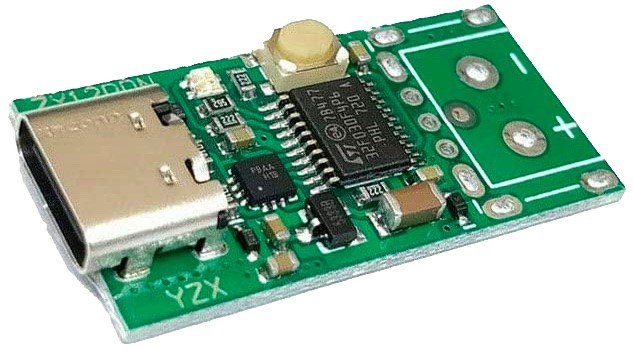
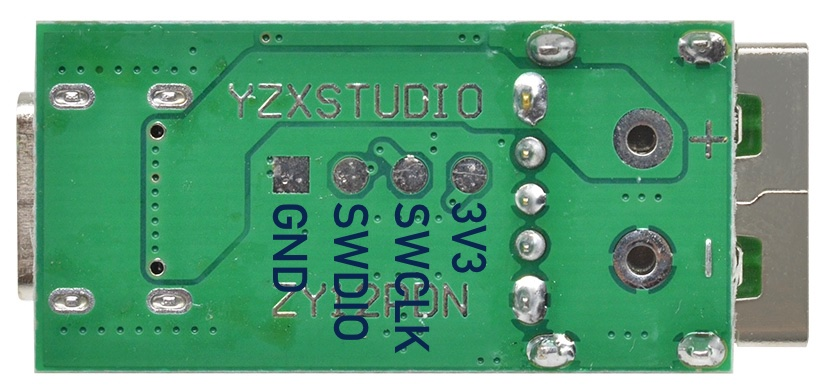

# Open-Source Firmware for ZY12PDN USB Power Delivery Trigger

## Building

- Clone the project from GitHub
- Open it with Visual Studio Code
- Install the PlatformIO extension
- Click the build icon in the status bar

## Upload

The ZY12PDN board has a 4-pin SWD pads at the bottom. Either solder wires to them or use a 4-pin adapter with pogo pins.

Connect the SWD pads with an ST-Link, J-Link or Black Magic Probe to your computer and click the upload icon in the status bar of Visual Studio Code.

In most cases, you will need to try twice since the board does not enable the SWD pins quickly enough.

## Notes

- So far, the only supported messages are *Capabilities* (the source announcing the supported voltages) and *Request* (the sink requesting a specific voltage). More to come soon.
- In the `source_caps_changed` callback, `request_power` must be called to request a voltage -- even if it is 5V. Otherwise the source is likely to reset.
- VBUS is directly connected from the USB-C socket to VBUS (+) of the output. So for the board to be more useful, it would probably make sense to add a MOS-FET as a switch further downstream so that power is only turned on once the correct voltage is available. Initially, VBUS will always start with 5V. To control the MOSFET, you have to solder a wire to one of the unused MCU pins.
- The firmware is currently limited to the fixed voltages. Additionally capabilities (variable voltages etc.) can be easily added.
- The firmware does not properly work with Apple's 87W USB-C Power Adapter. It eventually works but the voltage is cut for a short time and reapplied. The firmware reboots and after that is occupied with endless interrupts. 
- Using the build flag `-D PD_DEBUG`, debugging output can be enabled. In order to see it, you have to solder a wire to PA2 (USART2 TX pin) and connect it to a serial adapter. The baud rate is 115,200 bps.
- All the code is very timing sensitive. Be very careful with debugging output in the `source_caps_changed` callback. It the debugging output takes too long, the USB power supply will likely reset and even cut the power.

## Firmware Mode

The designers have made two decisions that are unfortunate for hackers:

1. They do not use I2C pins of the I2C peripheral.
2. The pin for SWDIO and INTN is shared.

This was probably made to make the board smaller as the resulting traces are very short indeed:

Challenge 1 is solved with I2C bit-banging.

Challenge 2 is somewhat trickier. The firmware needs to decide if a debugger is connected or not:

- If a debugger is connected, the FUSB302B is turned off so it releases the SWDIO pin and the SWD has to be enabled.
- If no debugger is connected, the FUSB302B is configured, and it uses the SWDIO to signal interrupts.

Currently, SWCLK is initially configured as input with an external interrupt. If activity is detected, FSUSB302B is shut down and the SWCLK and SWDIO are restored for SWD operation. This has two disadvantages: it can be inadvertently triggered by touching the SWCLK pad on the bottom of the board, and swtich to firmware mode is not always fast enough so uploading firmware takes two attemps.

If you know of a better approach to detect a debugger, let me know.

SWD can be used to upload new firmware. But debugging is not possible as in normal operation, the SWDIO pin is used as the interrupt pin.
