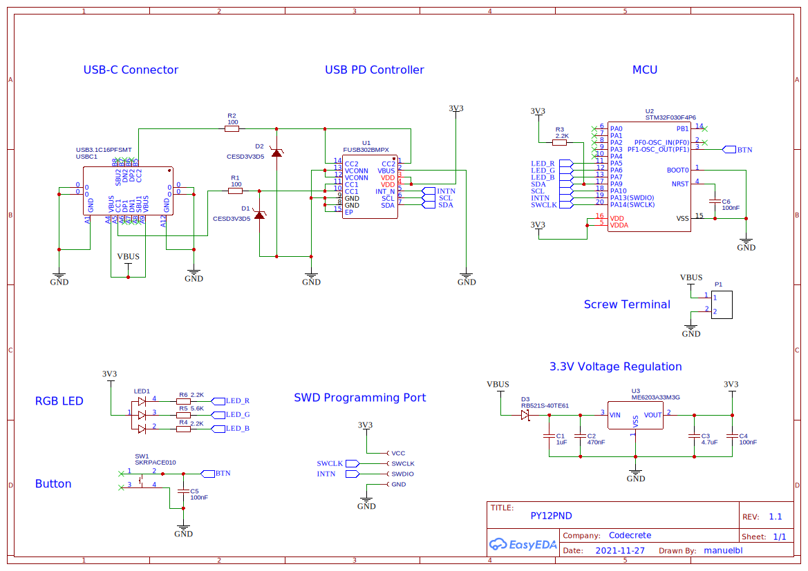
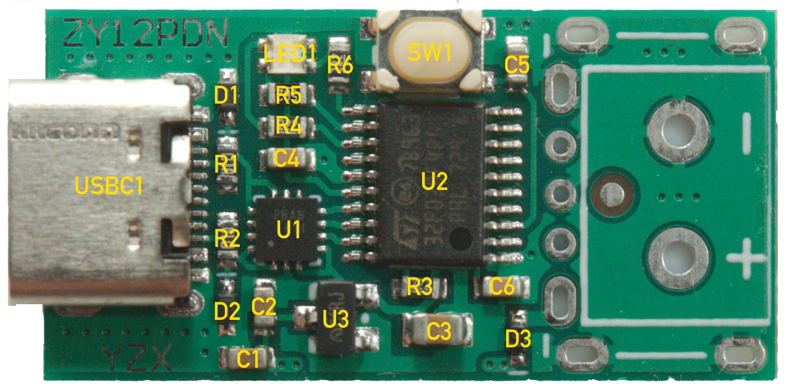
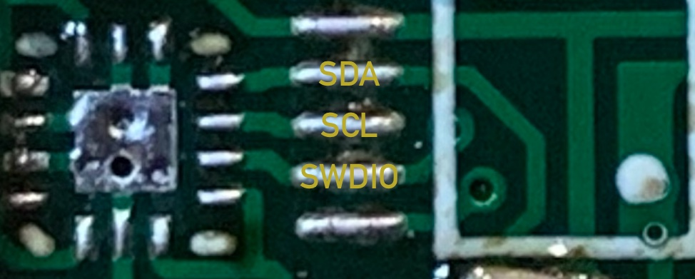

# Hardware

## Schematic

The SWD programming port is available as 4 pads on the bottom side of the board.

## Components

| Label | Component | Purpose |
| ----- | --------- | ------- |
| U1    | FUSB302BMPX  | USB PD controller |
| U2    | STM32F030F4P6 | Microcontroller |
| U3    | ?         | 3.3V voltage regular (LDO), Vin up to 20V |
| D1, D2 | ?         | Diode, probably for ESD protection |
| D3    | ?         | Schottky diode, reverse voltage protection? |
| C1    | 1µF       | Decoupling capacitor at input of LDO |
| C2    | 470nF     | Decoupling capacitor at input of LDO |
| C3    | 4.7µF     | Decoupling capacitor at output of LDO |
| C4    | 100nF     | Decoupling capacitor at VDD/VDDA of MCU |
| C5    | 100nF     | Debouncing capacitor for button |
| C6    | 100nF     | Timing capacitor for reset |
| R1, R2 | 100Ω     | Input protection for CC1/CC2 |
| R3    | 2.2kΩ     | Pull-up resistor for SDA |
| R4    | 2.2kΩ     | Current limiting resistor for blue LED |
| R5    | 5.6kΩ     | Current limiting resistor for green LED |
| R6    | 2.2kΩ     | Current limiting resistor for red LED |
| SW1   | ?         | Tactile button |
| LED1  | ?         | RGB LED |
| USBC1 | ?         | USB-C connector |

## Notes

- The USB PD controller has a *VBUS* input to measure and monitor the VBUS voltage. The pin is connected to ground. Therefore, the VBUS monitoring cannot be used.
- The I2C pins of the MCU are PA9 and PA10 for SCL and SDA, respectively. However, the SCL and SDA traces are connected to PA10 and PA9. Thus they are swapped to save board space with short traces (see image below). Therefore, the MCU's I2C peripheral cannot be used. Instead, I2C bit banging must be used.
- The SWDIO pin is connected to both SWDIO and the USB PD controller's interrupt pin, again to achieve short traces (see below). Tricks must be used to ensure firmware can still be uploaded. See below how to revive the board if the trick fails.
- VBUS of the USB-C connector is directly connected to the positive contacts of the output. There is no controllable switch in-between. Therefore, there will always be 5V on the output when the board is initially connected to a power supply, no matter how sophisticated the firmware is. To improve, a MOSFET would need to be connected down-stream and controlled from the MCU.
- There are several unused MCU pins that can be used for different purposes: PA0 thru PA4 and PB1. The firmware can use PA2 for serial output (debugging).

## Revive Board

If the board can no longer be flashed with the SWD connector on the bottom side because the firmware cannot stop the PD controller from interfering with the SWDIO line, the board can be revive like so:

- Solder a wire to NRST. The easiest location for soldering is capacitor C6 (on the left side of the capacitor in the above image).
- Connect all four SWD pins plus NRST to a debug adapter.
- Use a firmware upload/erase configuration that connects under reset.
- Erase the flash.

I've been successful with a J-Link adapter and J-Flash Lite (but not with J-Flash). An ST-Link adapter and the proper configuration might also work if you know how.
